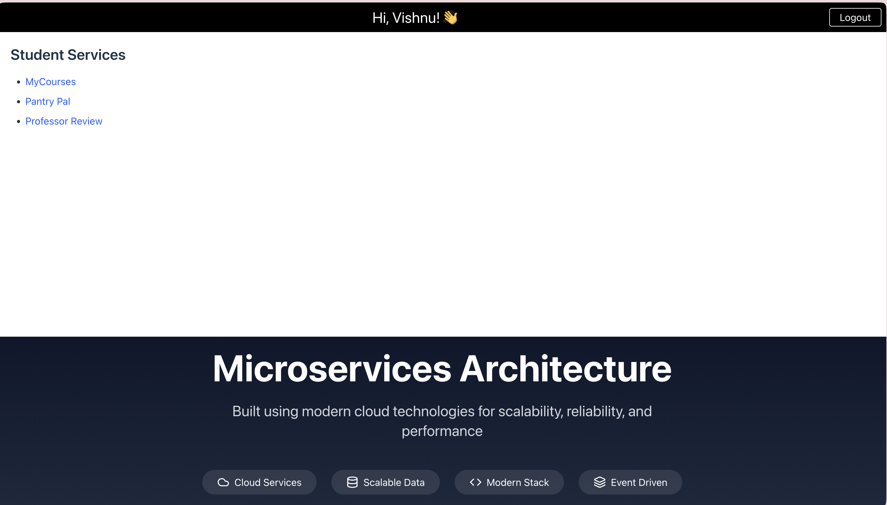
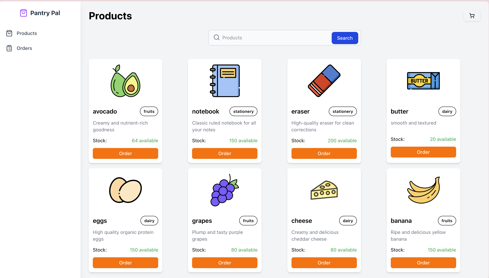
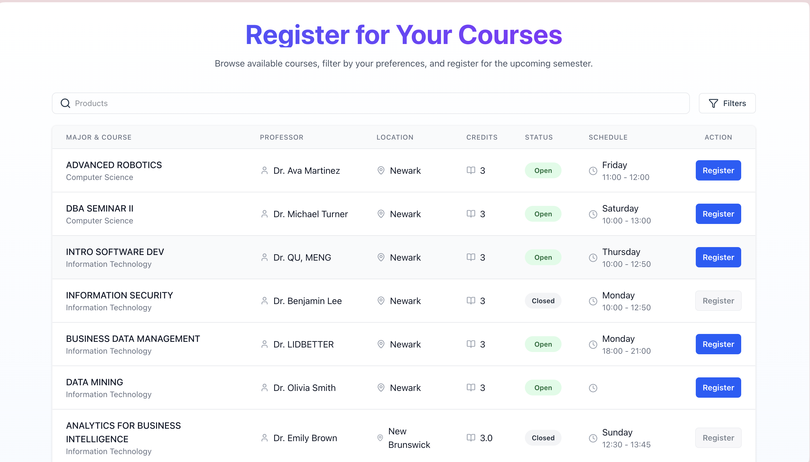
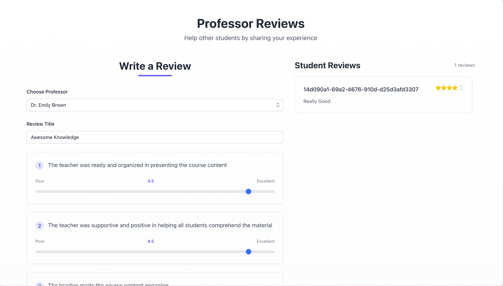

# EduConnect App (Microservice application)

🌐 Live Demo: [https://educonnect.com](https://educonnect.com)  

Welcome to the **EduConnect** repository! This repository is structured into multiple directories, each serving a specific purpose. Below is a detailed description of each directory and its contents.

---

## Screenshots







---

## Directory Overview

### **frontend**
This directory contains the **React** application that powers the front-end of EduConnect.

- **How to Get Started:**
  1. Navigate to the `frontend` directory.
  2. Install the dependencies:
     ```bash
     npm install
     ```
  3. Start the application:
     ```bash
     npm run dev
     ```

---

### **cdk-backend**
This directory contains the **AWS CDK** codebase used for deploying backend infrastructure.

- **How to Deploy:**
  1. Navigate to the `cdk-backend` directory.
  2. Run the following command to deploy all stacks:
     ```bash
     cdk deploy --all
     ```
  3. Create a `.env` file and add your environment variables.

---

## How to Clone the Repository
To get started with this repository, clone it using the following command:
```bash
git clone https://github.com/visnu1/EduConnect.git
